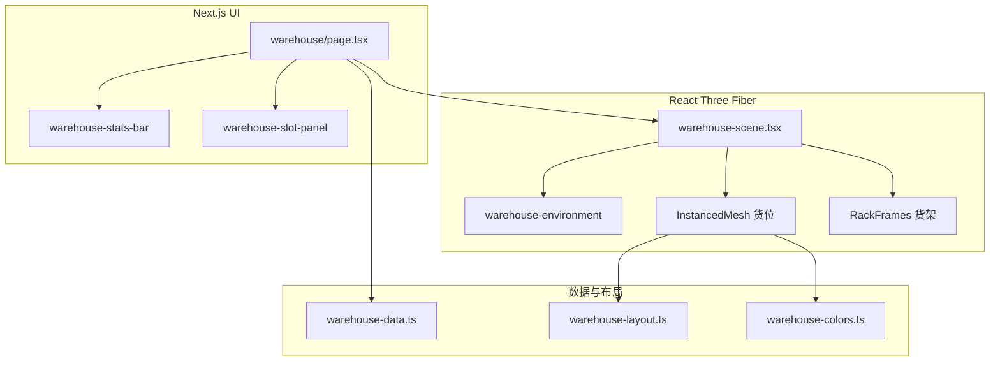

# 用 Next.js + React Three Fiber 打造 3D 快递仓储可视化

> 开源项目：[3d-express-warehouse](https://github.com/jiaxiantao/3d-express-warehouse)  
> 在线演示：https://jiaxiantao.github.io/3d-express-warehouse/

## 写在前面

仓储管理系统（WMS）的后台表格能精确记录每一个货位，但运营与参观场景里，「一眼看懂」往往比逐行翻表更重要。本文介绍一个开源方案：在浏览器里用 **Three.js + React Three Fiber** 将货位状态映射为可交互的 3D 货架，支持状态筛选、选中详情、一键操作与 URL 深链分享。

项目目标可以概括为三点：

1. **数据映射**：空闲 / 在库 / 低库存 / 满仓 / 异常 / 预留 / 锁定 → 不同颜色与面板信息  
2. **一眼看懂**：统计面板 + 3D 高亮筛选 + 选中描边  
3. **一键管理**：补货、清空、锁定等操作触发 3D 动画反馈  

---

## 效果预览


> **截图占位**：打开 `/warehouse`，截取完整控制台（顶部统计、中间 3D 场景、右侧货位面板区域），保存为 `documentation/images/blog-01-dashboard.png`。

---

## 技术栈

| 层级 | 选型 | 说明 |
|------|------|------|
| 框架 | Next.js 16 · React 19 | App Router，`/` 重定向至 `/warehouse` |
| 3D | three · @react-three/fiber | 无 `@react-three/drei`，减少依赖与包体 |
| 样式 | Tailwind CSS 4 | 深色控制台 UI |
| 语言 | TypeScript 5 | 严格模式 |
| 部署 | GitHub Pages 静态导出 | `basePath: /3d-express-warehouse` |

仓库规模：3 条巷道 × 6 列 × 4 层 × 双侧 = **144 个货位**，足够展示真实布局与性能取舍，又不会在开发机上拖垮编译。

---

## 整体架构

业务状态集中在 React 页面，3D 场景只负责「呈现 + 拾取」，数据层预留 WMS 对接入口。




> **截图占位**：可将上文 Mermaid 在编辑器中导出为 PNG，或手绘分层架构图，保存为 `documentation/images/blog-07-architecture.png`。

### 状态归属

| 模块 | 职责 |
|------|------|
| `warehouse/page.tsx` | 货位列表、选中 ID、筛选、视角、操作脉冲、截图/全屏 |
| `warehouse-scene.tsx` | WebGL 生命周期、实例矩阵、射线选中、相机预设 |
| `warehouse-data.ts` | Mock 数据生成与本地 mutation（可换 API） |
| `warehouse-layout.ts` | **单一坐标源**：货架与货位世界坐标 |
| `warehouse-slot-panel.tsx` | 选中货位详情与操作按钮 |

---

## 路由与按需加载 Three.js

3D 相关代码体积大，若在根布局加载会拖慢整站编译与首屏。项目采用：

```tsx
// src/app/warehouse/page.tsx
const WarehouseScene = dynamic(
  () => import("@/components/warehouse-scene").then((mod) => mod.WarehouseScene),
  { ssr: false, loading: () => <LoadingPlaceholder /> },
);
```

- 仅 `/warehouse` 路由加载 R3F Canvas  
- `ssr: false` 避免 WebGL 在服务端执行  
- 首页 `/` 用客户端 `router.replace("/warehouse")`，兼容 GitHub Pages 静态导出  

Canvas 使用 `frameloop="demand"`：无动画时停止持续渲染，在 `useFrame` 或交互后调用 `invalidate()` 触发重绘，降低空闲功耗。

---

## 单一坐标源：告别穿模

早期原型里货架横梁与货位立方体各写一套魔法数字，稍改列宽就会穿模。最终约定：**所有世界坐标从 `warehouse-layout.ts` 导出**。

```ts
// 布局常量（节选）
export const WAREHOUSE_LAYOUT = {
  aisles: ["A", "B", "C"],
  baysPerAisle: 6,
  levelsPerBay: 4,
  slotWidth: 1.15,
  slotHeight: 0.75,
  slotDepth: 0.95,
  bayGap: 0.12,
  levelGap: 0.08,
  aisleSpacing: 5.5,
  // ...
};

export const SLOT_FIT_RATIO = 0.86;        // 相对格口缩放，留出立柱间隙
export const SLOT_DEPTH_FIT_RATIO = 0.82; // 深度方向再收缩，避免突出货架
```

货位世界坐标由 `getSlotWorldPosition(slot)` 统一计算；货架立柱、横梁、纵梁、封顶均引用同一套 `getBayPitch()`、`getLevelPitch()`、`getRackOriginX()` 等函数。调整 `WAREHOUSE_LAYOUT` 一处，货架与货位同步移动。

货架结构包括：

- 4 根角立柱 + 每隔一列的列间立柱（前后各一根）  
- 每层前后横梁 + 左右纵梁 + 列间纵梁  
- 顶层封顶横梁（无列间纵梁，避免视觉拥挤）  

---

## 144 个货位：InstancedMesh 分组渲染

若每个货位一个 `Mesh`，draw call 与 React 节点数都会偏高。项目按 **7 种 `SlotStatus`** 分组，每组一个 `InstancedMesh`，共享几何体与材质：

```tsx
// 每组状态独立材质（MeshBasicMaterial，toneMapped: false）
{SLOT_STATUSES.map((status) => (
  <InstancedStatusSlotBatch
    key={status}
    status={status}
    material={statusMaterials[status]}
    entries={grouped[status]}
    // ...
  />
))}
```

### 为什么不用 `instanceColor`？

在 Three.js r181 + R3F 环境下，`InstancedMesh` 搭配 `instanceColor` + `MeshLambertMaterial` 曾出现 **整批货位全黑** 的问题；模块级材质在 HMR 后也可能绑定失效。最终方案：

- 按状态拆成 7 个 `InstancedMesh`  
- 每组 `MeshBasicMaterial` 纯色，在 Canvas 内 `useMemo` 创建并在卸载时 `dispose`  
- 颜色定义集中在 `warehouse-colors.ts`  


> **截图占位**：在 3D 场景中同时展示青绿（在库）、黄色（低库存）、紫色（预留）等货位，保存为 `documentation/images/blog-02-status-colors.png`。

每帧在**单个** `useFrame` 中批量 `setMatrixAt` 更新实例矩阵，避免在循环里 `new THREE.Vector3()`，选中与 hover 仅影响对应实例的 scale。

---

## 状态筛选：半透明压暗

统计栏可筛选「在库 / 低库存 / 异常」等，3D 侧需让匹配货位突出、其余退后。

**踩坑**：对整块 `InstancedMesh` 开 `transparent: true` 时，透明物体无法按实例排序，会出现「有的面半透明、有的面仍然实心」的斑驳现象。

**解法**：

- **匹配状态**：继续用 `InstancedMesh`，不透明，略提亮  
- **未匹配状态**：改为**每个货位独立 `mesh`**，`opacity ≈ 0.22`，`depthWrite: false`，由 Three.js 按物体排序混合  


> **截图占位**：点击「低库存」筛选，黄色货位高亮、其余货位半透明，保存为 `documentation/images/blog-03-filter-low-stock.png`。

---

## 选中描边：流动线框且不侵占货位

选中货位后，需要清晰的视觉反馈，但**不能放大货位立方体**（否则会挤占邻格空间）。

实现要点：

1. 货位 mesh 保持原始 `SLOT_FIT_RATIO` 缩放  
2. 单独渲染 `SelectedSlotOutline`：`LineSegments2` + `LineMaterial`（`worldUnits: true`）  
3. 线框几何比货位外扩约 `0.045` 世界单位，贴在箱体**外侧**  
4. 描边颜色跟随货位状态色（`getSlotSelectionOutlineColors`）  
5. `dashOffset` 在 `useFrame` 中递增，形成流动虚线；材质引用放在 `useRef`，满足 React 19 `react-hooks/immutability` 规则  


> **截图占位**：选中单个货位，特写棱边青色流动描边，保存为 `documentation/images/blog-04-selection-outline.png`。

---

## 右侧面板与操作动画

点击货位后，右侧 `WarehouseSlotPanel` 展示 SKU、库存进度条与操作按钮。操作通过 `actionPulse` 下发至 3D 层：

```ts
// warehouse-animations.ts
export function getActionVisual(action: SlotAction, progress: number) {
  switch (action) {
    case "restock":  return { scaleMul: 1 + sin * 0.22, yLift: ... }; // 弹跳
    case "clear":    return { scaleMul: 1 - sin * 0.35, ... };         // 收缩
    case "toggle-lock": return { shakeX: ... };                        // 抖动
    // ...
  }
}
```

3D 场景根据 `actionPulse.slotId` 在对应实例上叠加 scale / 位移，约 720ms 缓动结束。


> **截图占位**：选中货位后右侧面板（含补货/清空/锁定等按钮），保存为 `documentation/images/blog-05-slot-panel.png`。

---

## 多视角与工具栏

三种相机预设写死在 `VIEW_CAMERA` 常量中，切换 `viewMode` 时平滑插值相机位置：

| 模式 | 用途 |
|------|------|
| `overview` | 全景鸟瞰 |
| `aisle` | 巷道透视 |
| `top` | 正俯视 |

另支持 **截图**（`gl.domElement.toBlob`）与 **全屏**（`requestFullscreen`）。


> **截图占位**：分别切换全景 / 巷道 / 俯视截图，可拼成一张横向对比图，保存为 `documentation/images/blog-06-camera-views.png`。

---

## URL 深链

选中货位、视角、筛选条件同步到 query：

```
/warehouse?slot=A-03-L2&view=aisle&filter=low
```

`readWarehouseUrlState()` 在 `useEffect` 中读取，避免 SSR hydration 不一致；`useWarehouseUrlState` 用 `history.replaceState` 写回，便于分享与书签。

---

## 接入真实 WMS

Mock 层在 `warehouse-data.ts`，替换入口清晰：

1. `createWarehouseState()` → `GET /api/slots`  
2. `applySlotAction()` → 对应写接口（补货、移库、锁定）  
3. 可选 WebSocket 推送 `slots` 更新，驱动 3D 重绘  

类型契约见 `warehouse-types.ts` 中的 `WarehouseSlot` / `SlotStatus` / `SlotAction`。

---

## 性能与工程化备忘

| 项 | 做法 |
|----|------|
| 渲染 | `frameloop="demand"` + `dpr={1}` |
| 矩阵更新 | 单 `useFrame`、复用 `Object3D` 临时变换 |
| 材质 | 按状态分组；筛选态未匹配改用独立 mesh |
| 开发内存 | Three 仅挂在 `/warehouse`；`NODE_OPTIONS=--max-old-space-size=2048` |
| CI | `pnpm lint` / `typecheck` / `build`；`docs/**` 从 ESLint 排除 |
| 部署 | `pnpm build:pages` 导出至 `docs/`，GitHub Actions 自动更新 Pages |

---

## 本地运行

```bash
git clone https://github.com/jiaxiantao/3d-express-warehouse.git
cd 3d-express-warehouse
pnpm install
pnpm dev
# http://localhost:3100/warehouse
```

---

## 总结

3D 仓储可视化的难点往往不在「画出一个立方体」，而在：

1. **布局单一数据源**，避免货架与货位各算各的坐标  
2. **144 货位的绘制策略**（InstancedMesh 分组 + 透明筛选时的 per-mesh 降级）  
3. **选中与筛选的视觉语言**（外扩线框、状态色描边、不放大货位本体）  
4. **React 与 WebGL 的生命周期协作**（dynamic import、demand 渲染、hooks 与可变材质）  

如果你在做 WMS 大屏、园区参观演示或物流教学项目，欢迎 Star、[提 Issue](https://github.com/jiaxiantao/3d-express-warehouse/issues) 或基于 MIT 协议二次开发。

---

## 延伸阅读

- [ARCHITECTURE.md](./ARCHITECTURE.md) — 模块职责与扩展点  
- [README.md](../README.md) — 快速开始与部署  
- [在线演示](https://jiaxiantao.github.io/3d-express-warehouse/)
