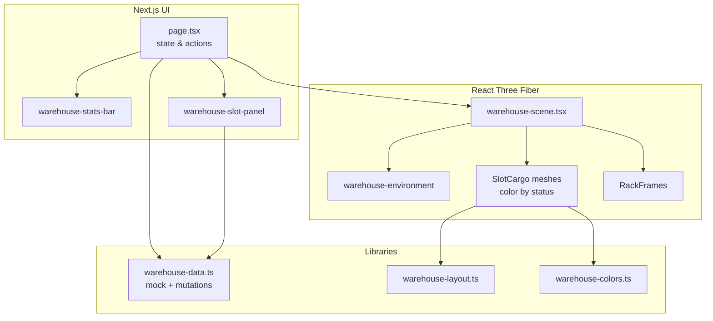

# Architecture

This document describes how the 3D warehouse visualization is structured.

## High-level flow

## State ownership

| Layer | Responsibility |
|-------|----------------|
| `page.tsx` | Slot list state, selection, filters, view mode, screenshot / fullscreen |
| `warehouse-scene.tsx` | WebGL lifecycle, slot mesh placement, raycast selection, camera presets |
| `warehouse-data.ts` | Demo data generation and local slot mutations (replace with WMS API) |
| `warehouse-slot-panel.tsx` | Selected slot detail and one-click management actions |

## Slot → 3D mapping

1. `warehouse-layout.ts` defines aisle / bay / level geometry.
2. `getSlotWorldPosition()` maps each `WarehouseSlot` to `[x, y, z]`.
3. `SlotCargo` renders a box mesh colored by `warehouse-colors.ts` from `slot.status`.
4. Inventory fill ratio is shown in the side panel (not as mesh scale) to keep the grid readable.

## Extension points

- **Real WMS:** swap `createWarehouseState` / `applySlotAction` for API calls.
- **Larger warehouse:** adjust `WAREHOUSE_LAYOUT` or load layout from config JSON.
- **Custom models:** replace procedural racks with GLB instancing while keeping slot IDs on meshes.
- **Alerts:** push WebSocket events to update `slots` state and emissive pulse on warning slots.
